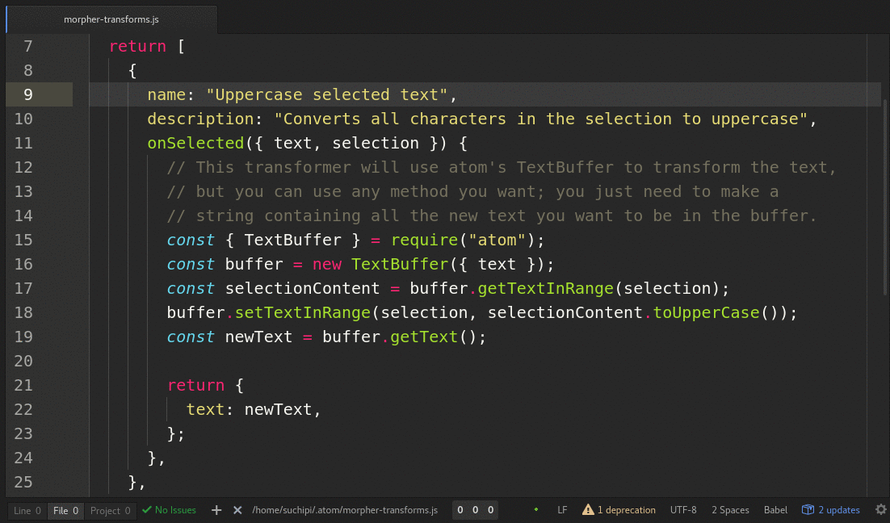

# morpher

`morpher` is a package for the atom text editor that provides an API and UI for
programmatically changing the text, cursor position, and selection range of the
current buffer.

The user writes "transforms" in `~/.atom/morpher-transforms.js`, and can bring
up a list of these transforms, then choose one to execute on the current buffer.



Transform functions receive:
* The text in the current buffer
* The current cursor position
* The current selection range
* The absolute path to the current file (if any)

And can modify:
* The text in the current buffer
* The current cursor position
* The current selection range

# Documentation

All transforms are defined in `~/.atom/morpher-transforms.js`, known as "the
transforms file". Each time the command "Morpher: Open Transform List" is run
(from the command palette or via keystroke), morpher loads all the transforms
exported from this file and presents them in a list to the user.

> Morpher will reload the transforms file each time you open the list.

The transforms file should export a function that returns either an Array of
transforms or a Promise that resolves to an Array of transforms.

A transform is an object with these properties:
* `name` is a required string. This is the name that will be shown in the list.
* `description` is an optional string. If present, it will be displayed
  underneath the name in the list.
* `variables` is an optional object, or function returning an object.
  If present, after the user selects this transform, they will be prompted to
  enter values for these variables in another dialog.
  If a function is given, it will be called with the same props as `onSelected`
  (except the `variableValues`) and must return an object.
  The key is the variable name, and the value is an object containing additional
  options:
  * `label` (default: variable name) - the label for the editor in the variables dialog
  * `multiline` (default: `false`) - if `true`, use a multiline editor
  * `defaultValue` (default: empty string) - the initial value for the editor
* `onSelected` is a required function that will be called when the user selects
  the transform.

The `onSelected` function will be called with an object called the "buffer
state". The buffer state represents the current state of the active buffer in
the editor. It has these properties:
* `text`: A string containing all the text in the buffer.
* `cursorPosition` A [Point](https://atom.io/docs/api/latest/Point) representing
  the current position of the cursor in the buffer.
* `selection`: A [Range](https://atom.io/docs/api/latest/Range) representing the
  current selection in the buffer.
* `filePath`: A string containing the absolute path the current file open in the
  buffer. If the current buffer does not refer to a file (ie "untitled"), this
  property will be undefined.
* `selectedText`: A string containing the selected text in the buffer.
* `variablesValues`: if the transform requested `variables` in its config, this will
  be an object containing the values for the variables entered by the user.

The return value of the `onSelected` function is an object describing the
changes that should be applied to the buffer, called a "transform result".
`onSelected` can return a transform result or a Promise that resolves to one.
A transform result has these properties:
* `text`: An optional string. If included, the buffer text will be replaced with
  this text.
* `selectedText`: An optional string. If included, the selected text in the
  buffer will be replaced with this text.
* `cursorPosition`: An optional [Point](https://atom.io/docs/api/latest/Point)
  (or Point-compatible Array). If included, the cursor will be moved to the new
  position specified.
* `selection`: An optional [Range](https://atom.io/docs/api/latest/Range) (or
  Range-compatible Array). If included, the selection will be changed to the
  range specified.

You may notice that a transform result is shaped almost the same as a buffer
state, but does not include `filePath`.

Here are some flowtype definitions for the concepts:
```js
type BufferState = {
  text: string,
  selectedText: string,
  cursorPosition: Point,
  selection: Range,
  filePath?: string,
  variables?: {[variable: string]: string},
};

type TransformResult = {
  text?: string,
  selectedText?: string,
  cursorPosition?: Point | [number,  number],
  selection?: Range | [[number, number], [number, number]],
};

type VariablesConfig = {
  [variable: string]: {
    label?: string, // (default: variable)
    multiline?: boolean, // (default: false)
    defaultValue?: string, // (default: empty string)
  },
};

type Transform = {
  name: string,
  description?: string,
  onSelected: (BufferState) => TransformResult | void | Promise<TransformResult | void>,
  variables?: VariablesConfig | (BufferState) => (VariablesConfig | Promise<VariablesConfig>),
};

type TransformsFileExport = () => Array<Transform> | Promise<Array<Transform>>,
```

Here's some example transforms:
```js
const { TextBuffer, Point } = require("atom");

module.exports = function() {
  return [
    {
      name: "Uppercase selected text",
      description: "Converts all characters in the selection to uppercase",
      onSelected({ selectedText }) {
        return { selectedText: selectedText.toUpperCase() };
      },
    },
    {
      name: "Move cursor to start",
      onSelected() {
        return {
          cursorPosition: new Point(0, 0)
        };
      },
    },
    {
      name: "Add // @flow",
      description: "Adds '// @flow' to the top of the file (if not present)",
      onSelected({ text }) {
        if (text.split("\n")[0].indexOf("// @flow") === -1) {
          return { text: "// @flow\n" + text };
        }

        // If you don't return anything, nothing will happen
      }
    },
  ];
};
```
